# Gleaner Data Storage Diagram

Gleaner currently supports **Claude Code** and **Cursor** capture as same-tier official sources. Support for Codex capture is in-scope for the overall project but is pending (landing separately in another branch).

```mermaid
flowchart TB
    subgraph LOCAL_CLIENT["LOCAL CLIENT MACHINE"]
        direction TB

        subgraph CLAUDE_CODE["Claude Code (source data, read-only)"]
            CC_SESSIONS["~/.claude/projects/{project}/{session_id}.jsonl
            ────────────────────────────
            Format: JSONL (uncompressed)
            Size: 5KB-200KB per session
            One JSON object per line:
            { type: user|assistant,
              timestamp: ISO 8601,
              message: { content: [...] } }"]
        end

        subgraph CURSOR["Cursor (source data, read-only)"]
            CUR_SESSIONS["~/.cursor/projects/{project}/agent-transcripts/{id}/{id}.jsonl
            ────────────────────────────
            Format: JSONL (uncompressed)
            Size: 5KB-200KB per session
            One JSON object per line:
            { role: user|assistant,
              content: [...] }
            Note: no per-message timestamps"]
        end

        subgraph CLIENT_CONFIG["Client Config"]
            GLEANER_JSON["~/.config/gleaner.json
            ────────────────────
            Format: JSON
            { url: string,
              token: string }
            Written by: gleaner setup
            Read by: gleaner upload/pull"]

            CLAUDE_SETTINGS["~/.claude/settings.json
            ────────────────────
            Format: JSON
            hooks.SessionEnd array
            Written by: gleaner install-hook
            Read by: Claude Code (triggers upload)"]

            CURSOR_HOOKS["~/.cursor/hooks.json
            ────────────────────
            Format: JSON
            hooks.stop array
            Written by: gleaner install-hook
            Read by: Cursor (triggers upload)"]
        end

        subgraph PULL_OUTPUT["Pulled Data (~/.gleaner/)"]
            PARQUET["sessions.parquet
            ────────────────────────────
            Format: Apache Parquet + Zstandard compression
            Columns:
              session_id, user, host, platform,
              project, topic, cwd,
              message_count, user_message_count,
              assistant_message_count, tool_use_count,
              tool_counts_json (JSON string),
              first_timestamp, last_timestamp,
              transcript_size, transcript_gz_size,
              uploaded_at, redactions,
              source, task_type
            ────────────────────────────
            Incremental merge: dedup by session_id
            Written by: gleaner pull
            Sync key: max(uploaded_at)"]

            TRANSCRIPTS_DIR["transcripts/{session_id}.jsonl.gz
            ────────────────────────────
            Format: Gzip-compressed JSONL
            Optional (--transcripts flag)
            Cached: skips already-downloaded files
            Written by: gleaner pull --transcripts"]
        end
    end

    subgraph UPLOAD_PIPELINE["UPLOAD PIPELINE (gleaner-upload CLI)"]
        direction LR
        PARSE["parse_transcript()
        Extract metadata:
        message counts, tool counts,
        timestamps, topic, cwd"]

        SCRUB["scrub_text()
        PII/secret removal
        Engine: Presidio or legacy regex
        Output: redactions count"]

        TAG["tag_session()
        Classify:
        source: human|kodo|test
        task_type: development|swe_bench|
        merge_conflict|verification|
        commit|analysis|kodo_harness|
        kodo_other|test"]

        COMPRESS["gzip compress
        transcript bytes"]

        PARSE --> SCRUB --> TAG --> COMPRESS
    end

    subgraph SERVER["GLEANER SERVER (FastAPI)"]
        direction TB

        API_WRITE["POST /api/session
        Receives: metadata JSON + gzip transcript
        Auth: Bearer token"]

        API_READ["GET /api/stats
        GET /api/me
        GET /api/user/{name}/stats
        GET /api/sessions
        GET /api/session/{id}/transcript"]

        subgraph CACHE["In-Memory Cache"]
            STATS_CACHE["_cache: dict[str, tuple[float, dict]]
            ────────────────────────────
            Keys:
              'global_stats' -> aggregate stats
              'user_stats:{username}' -> per-user stats
            TTL: 300s (GLEANER_CACHE_TTL)
            Invalidated on new session upload"]
        end
    end

    subgraph GCP["GOOGLE CLOUD (project: covenance-469421)"]
        direction TB

        subgraph FIRESTORE["Firestore (NoSQL Document DB)"]
            direction TB

            FS_SESSIONS["Collection: sessions
            ────────────────────────────
            Document ID: session_id
            Fields:
              session_id: string
              topic: string (first user msg, max 200ch)
              project: string
              cwd: string
              message_count: int
              user_message_count: int
              assistant_message_count: int
              tool_use_count: int
              tool_counts: map {tool_name: count}
              first_timestamp: timestamp
              last_timestamp: timestamp
              transcript_size: int (bytes, uncompressed)
              transcript_gz_size: int (bytes, gzipped)
              gcs_path: string
              uploaded_at: timestamp
              redactions: int
              source: string
              task_type: string
              provenance: map {
                user: string,
                host: string,
                platform: string
              }"]

            FS_TOKENS["Collection: tokens
            ────────────────────────────
            Document ID: SHA256(raw_token)
            Fields:
              name: string
              issued_to: string
              owner_email: string
              notes: string
              prefix: string (first 8 chars)
              active: bool
              created_at: timestamp
              last_used_at: timestamp | null
              usage_count: int"]

            FS_USERS["Collection: users
            ────────────────────────────
            Document ID: email address
            Fields:
              username: string (2-20 chars)
              email: string
              display_name: string
              picture: string (URL)
              onboarded: bool
              created_at: timestamp"]

            FS_COUNTERS["Collection: counters
            ────────────────────────────
            Doc 'global':
              total_sessions, total_messages,
              total_tool_uses, tool_usage: map

            Doc 'global:daily':
              {YYYY-MM-DD}: session_count

            Doc 'global:users':
              {username}: { sessions, messages,
                tool_uses, total_duration_seconds,
                last_active }

            Doc 'global:projects':
              {project}: { sessions, messages,
                users: [username, ...] }

            Doc 'user:{username}' (per-user):
              total_sessions, total_messages,
              total_tool_uses, total_duration_seconds,
              tool_usage: map,
              project_usage: map,
              daily: { date: {s, m, d} },
              last_session_id, last_active"]
        end

        subgraph GCS["Google Cloud Storage"]
            GCS_SESSIONS["gs://gleaner-sessions/sessions/
            ────────────────────────────
            Path: sessions/{session_id}.jsonl.gz
            Format: Gzip-compressed JSONL
            Content: full conversation transcript
            Each line: JSON message object
            Size: 1-50KB compressed"]

            GCS_BACKUPS["gs://gleaner-sessions/backups/
            ────────────────────────────
            Path: backups/{YYYYMMDD-HHMMSS}/
            Format: Firestore export format
            Created by: POST /admin/backup
            Purpose: disaster recovery"]
        end
    end

    subgraph MOCK["MOCK MODE (GLEANER_MOCK=1)"]
        MOCK_STORE["db_mock.py — all in-memory dicts
        ────────────────────────────
        _tokens: dict[hash, metadata]
        _sessions: dict[id, metadata]
        _transcripts: dict[id, gzip bytes]
        _counters: dict[name, aggregates]
        _users: dict[email, profile]
        ────────────────────────────
        80 seed sessions across 90 days
        Same interface as real db.py"]
    end

    %% Data flows
    CC_SESSIONS -->|"SessionEnd hook
    reads .jsonl file"| UPLOAD_PIPELINE
    CUR_SESSIONS -->|"stop hook / periodic
    backfill agent"| UPLOAD_PIPELINE
    GLEANER_JSON -.->|"url + token"| UPLOAD_PIPELINE
    UPLOAD_PIPELINE -->|"POST metadata + gzip transcript"| API_WRITE

    API_WRITE -->|"store_session()"| FS_SESSIONS
    API_WRITE -->|"upload transcript_gz"| GCS_SESSIONS
    API_WRITE -->|"_update_counters()"| FS_COUNTERS
    API_WRITE -->|"invalidate cache"| STATS_CACHE

    FS_SESSIONS -->|"list_sessions()"| API_READ
    FS_COUNTERS -->|"get_stats() / get_user_stats()"| STATS_CACHE
    STATS_CACHE -->|"cached response"| API_READ
    GCS_SESSIONS -->|"get_session_transcript()"| API_READ
    FS_TOKENS -->|"validate_token()"| API_WRITE
    FS_TOKENS -->|"validate_token()"| API_READ

    API_READ -->|"gleaner pull
    GET /api/sessions"| PARQUET
    API_READ -->|"gleaner pull --transcripts
    GET /api/session/*/transcript"| TRANSCRIPTS_DIR

    FIRESTORE -->|"export_firestore()"| GCS_BACKUPS

    MOCK_STORE -.->|"replaces Firestore + GCS
    when GLEANER_MOCK=1"| SERVER

    %% Styling
    classDef cloud fill:#e8f0fe,stroke:#4285f4,color:#000
    classDef local fill:#e6f4ea,stroke:#34a853,color:#000
    classDef pipeline fill:#fef7e0,stroke:#f9ab00,color:#000
    classDef server fill:#fce8e6,stroke:#ea4335,color:#000
    classDef mock fill:#f3e8fd,stroke:#a142f4,color:#000

    class GCP,FIRESTORE,GCS,FS_SESSIONS,FS_TOKENS,FS_USERS,FS_COUNTERS,GCS_SESSIONS,GCS_BACKUPS cloud
    class LOCAL_CLIENT,CLAUDE_CODE,CURSOR,CLIENT_CONFIG,PULL_OUTPUT,CC_SESSIONS,CUR_SESSIONS,GLEANER_JSON,CLAUDE_SETTINGS,CURSOR_HOOKS,PARQUET,TRANSCRIPTS_DIR local
    class UPLOAD_PIPELINE,PARSE,SCRUB,TAG,COMPRESS pipeline
    class SERVER,API_WRITE,API_READ,CACHE,STATS_CACHE server
    class MOCK,MOCK_STORE mock
```

## Environment Variables Controlling Storage

| Variable | Default | Controls |
|---|---|---|
| `GLEANER_GCP_PROJECT` | `covenance-469421` | Firestore + GCS project |
| `GLEANER_GCS_BUCKET` | `gleaner-sessions` | GCS bucket name |
| `GLEANER_CACHE_TTL` | `300` (seconds) | In-memory stats cache TTL |
| `GLEANER_SCRUB_ENGINE` | `presidio` (if installed) | PII scrubbing backend |
| `GLEANER_MOCK` | unset | Swap all storage to in-memory dicts |
| `GLEANER_URL` | (from config file) | Server URL for uploads |
| `GLEANER_TOKEN` | (from config file) | Auth token for API |

## Key Design Decisions

- **No local database** — all metadata lives in Firestore; no SQLite/Postgres
- **Transcript/metadata split** — large transcripts in GCS, structured metadata in Firestore
- **Pre-aggregated counters** — stats are O(1) reads via `counters` collection, not computed on-the-fly
- **Incremental sync** — `gleaner pull` uses `max(uploaded_at)` to fetch only new sessions
- **PII scrubbing at upload time** — redacted before leaving the client machine
